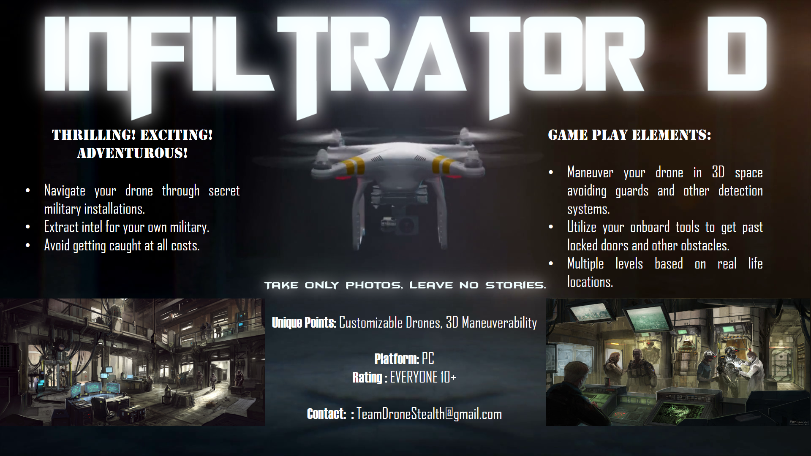
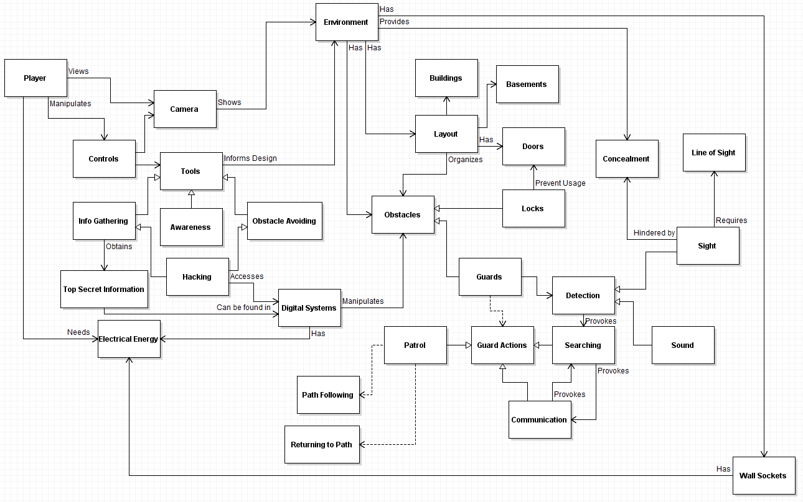

# PROJECT Design Documentation

# Team Information
* Team name: Team Drone Stealth
* Team members
  * Alabhya Maheshwari
  * Mark DelFavero
  * Jiayi Jiang
  * Shantanu Jamble
  * Victor Shu

## Executive Summary

This is a summary of the project.

### Purpose

The game we will be making is a stealth game in which the player controls a drone to sneak into enemy facilities. Since this game will be a 3D pure stealth game with drones, so the target audience will be:

 - People who like stealth games.
 - Drone enthusiasts.
 - People who like to explore the level.

For more details, see [the full market & user analysis document](MarketUserAnalysis.md).

#### Sell Sheet

### Glossary and Acronyms
> Provide a table of terms and acronyms.

| Term | Definition |
|------|------------|
| term/acronym | definition |

## Requirements

### Features

This section describes the main features of the game.

> In this section you do not need to be exhaustive and list every story.  Focus on top-level features and maybe Epics and *critical* Stories.

### Non-functional Requirements
> Key NFRs and technical constraints

## Domain

This section describes the application domain.

The overall domain for the Drone Stealth game is maneuvering in a three dimensional digital space while avoiding obstacles to achieve goals. 

For more details, see [the full domain document](DomainAnalysis.md).

## Architecture

This section describes the application architecture.

### Summary
Our architecture will need to connect to and build on top of Unity's existing architecture. This is how the overall architecture looks like.

For more details, see [the full architecture document](architecture.md).

### Component 1 ...
> Provide a summary of each component with extra models as needed

### Component 1 ...
> Provide a summary of each component with extra models as needed

## Detailed Design

> You'll add to this section as needed as the project progresses

* Tools: Implements `ToolComponent` which outlines a protocol for communicating with `PlayerController`
  * `CameraTool`: Activate once to enter camera mode, activate again to attempt to gain visual information

* Information System: Scoring system that tracks the player's gathering of information
  * `TopSecretInfo`: An simple component that denotes type and content of information. All information is currently named and if two pieces of info share a name, they will be considered the same. `TopSecretInfo` script owns all static `TopSecretInfo` tracking logic and functionality.
  * `InfoGather`: A component that records and stores information. It is smart enough to avoid transcribing duplicate info.
  
 * Enemy AI
  * `Enemy Movement`: A component that handles enemy behaviour of Patrol,Investigate and many more.
  * `Enemy Sight`: A component that enables enemy to look around and detect player's presence.

## Issues and Risks

> Open issues, risks, and your plan to address them (or plan to research options)
