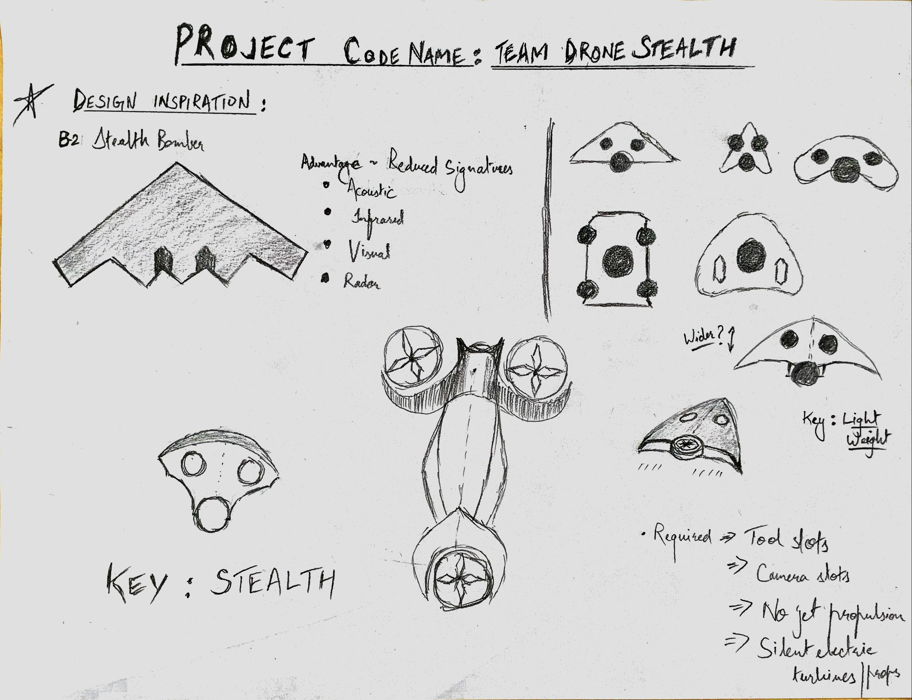
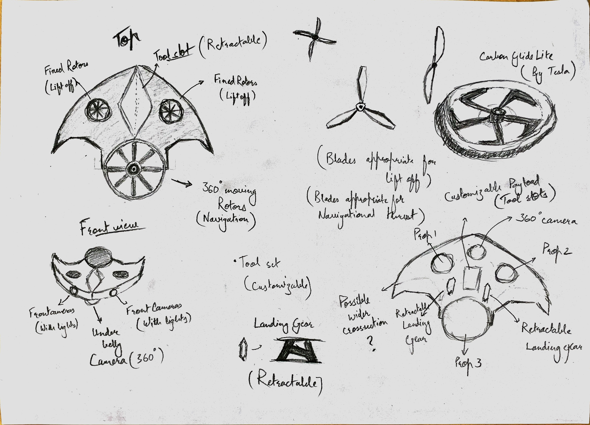

# PROJECT Design Documentation

# Team Information
* Team name: Team Drone Stealth
* Team members
  * Alabhya Maheshwari
  * Mark DelFavero
  * Jiayi Jiang
  * Shantanu Jamble
  * Victor Shu

## Executive Summary

This is a summary of the project.

### Purpose

The game we will be making is a stealth game in which the player controls a drone to sneak into enemy facilities. Since this game will be a 3D pure stealth game with drones, so the target audience will be:

 - People who like stealth games.
 - Drone enthusiasts.
 - People who like to explore the level.

For more details, see [the full market & user analysis document](MarketUserAnalysis.md).

#### Sell Sheet

#### Concept

### Glossary and Acronyms

| Term | Definition |
|------|------------|
| Horizontal Movement | The drone moves in regards to the X-Z plane. |
| Vertical Movement | The drone moves along the Y axis. |

## Requirements

### Features

This section describes the main features of the game.

 * Movement
   * Horizontal Movement
   * Vertical Movement

### Non-functional Requirements
> Key NFRs and technical constraints

## Domain

This section describes the application domain.

The overall domain for the Drone Stealth game is maneuvering in a three dimensional digital space while avoiding obstacles to achieve goals. 

For more details, see [the full domain document](DomainAnalysis.md).

## Architecture

This section describes the application architecture.

### Summary
Our architecture will need to connect to and build on top of Unity's existing architecture. This is how the overall architecture looks like.

For more details, see [the full architecture document](architecture.md).

## Detailed Design

> You'll add to this section as needed as the project progresses

* Tools: Implements `ToolComponent` which outlines a protocol for communicating with `PlayerController`
  * `CameraTool`: Activate once to enter camera mode, activate again to attempt to gain visual information
  * `ChargePointTool`: Activate to connect to nearby tagged Chargepoints and recharge energy. If a charge point is hackable,
you will also hack it for information or an effect.
  * `DecoyTool`: Equip to display trajectory. Activate to launch a decoy pellet for 10 energy

* Energy: Tools expend energy to function. 
  * ChargePoints: Points the drone can charge at.
  * Tools: Tools each have an energy cost.
  * Drain: Player energy drains constantly over time when the engine is running. When energy runs out, the player will die.

* Information System: Scoring system that tracks the player's gathering of information
  * `TopSecretInfo`: An simple component that denotes type and content of information. All information is currently named 
and if two pieces of info share a name, they will be considered the same. 
`TopSecretInfo` script owns all static `TopSecretInfo` tracking logic and functionality.
`TopSecretInfo` knows what type it is and other tools know how to collect certain types.
  * `InfoGather`: A component that records and stores information. It is smart enough to avoid transcribing duplicate info.
  
* Enemy AI
  * `Enemy Movement`: A component that handles enemy behaviour of Patrol, Investigate and many more.
  * `Enemy Sight`: A component that enables enemy to look around and detect player's presence.
  * `Enemy Hearing Ability`: A component that enables enemy detect suspicious things by listening.

* Environment Behaviors
  * `TransformBehavior` A component that listens for calls to its Activate and responds by lerping between two points.

* UI
  * `UIDeathTracker` A UI component that handles the logic for the death message on the UI.
  * `UICameraFlash` A UI component that handles the logic for the camera flash.
  * `UIEnergyTracker` A UI component that handles the logic for the energy bar on the UI.
  * `UIInfoTracker` A UI component that handles the logic for the info bar on the UI.
  * `UIReticuleController` A UI component that handles the logic for swapping reticules on the UI.
  * `UITextManager` A UI component that handles the logic for floating notifications on the UI.
  * `UIToolTracker` A UI component that handles the logic for the tool icon on the UI.

## Issues and Risks

> Open issues, risks, and your plan to address them (or plan to research options)
