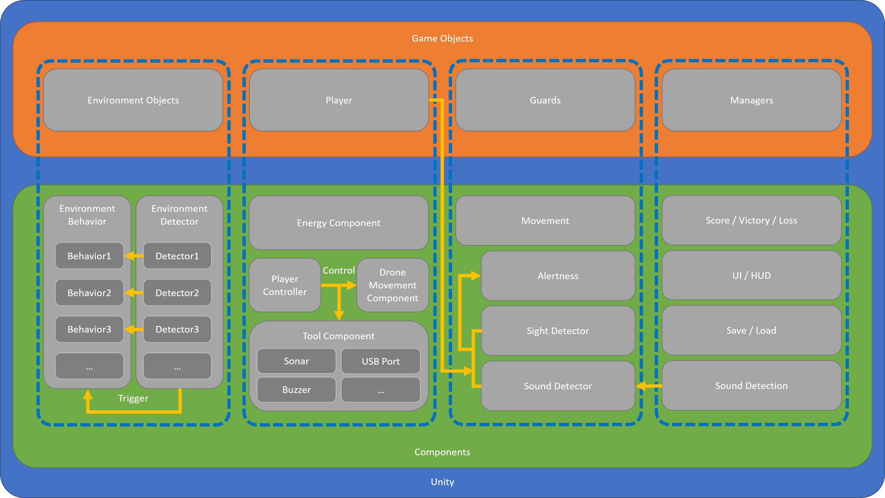

# Design Documents

## Market & User Analysis

The game we will be making is a stealth game in which the player controls a drone to sneak into enemy facilities. Since this game will be a 3D pure stealth game with drones, so the target audience will be:

 - People who like stealth games.
 - Drone enthusiasts.
 - People who like to explore the level.

For more details, see [the full market & user analysis document](MarketUserAnalysis.md).

## Technical Architecture

Our architecture will need to connect to and build on top of Unity's existing architecture. This is how the overall architecture looks like.

For more details, see [the full architecture document](architecture.md).

## Sell Sheet

TODO: waiting to be filled.